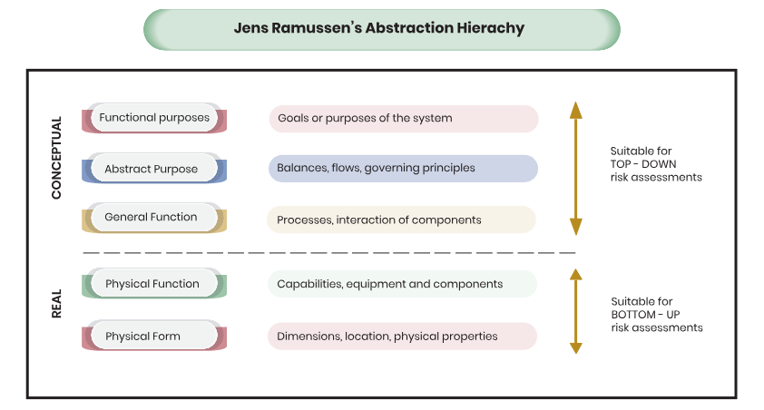

- pohľad cez komponenty (_component-driven methods_)
- pohľad cez systém (_system-driven methods_)

| prvok | component | system |
|-|-|-|
| pohľad | zdola nahor | zhora nadol |
| sústreďuje sa na | jednotlivé komponenty | systém ako celok |
| prvok | hardvér, softvér, zamestnanec | architektúra, pracovný postup, tok dát |
| vhodný pri | jednoduchých systémoch a jasne definovaných prepojeniach | komplexných vzájomných interakciách a nejasných vzťahoch |
| vhodný pri | jednoduchých systémoch a jasne definovaných prepojeniach | komplexných vzájomných interakciách a nejasných vzťahoch |

- metodý sú komplementárne
- vizualizácia techník

